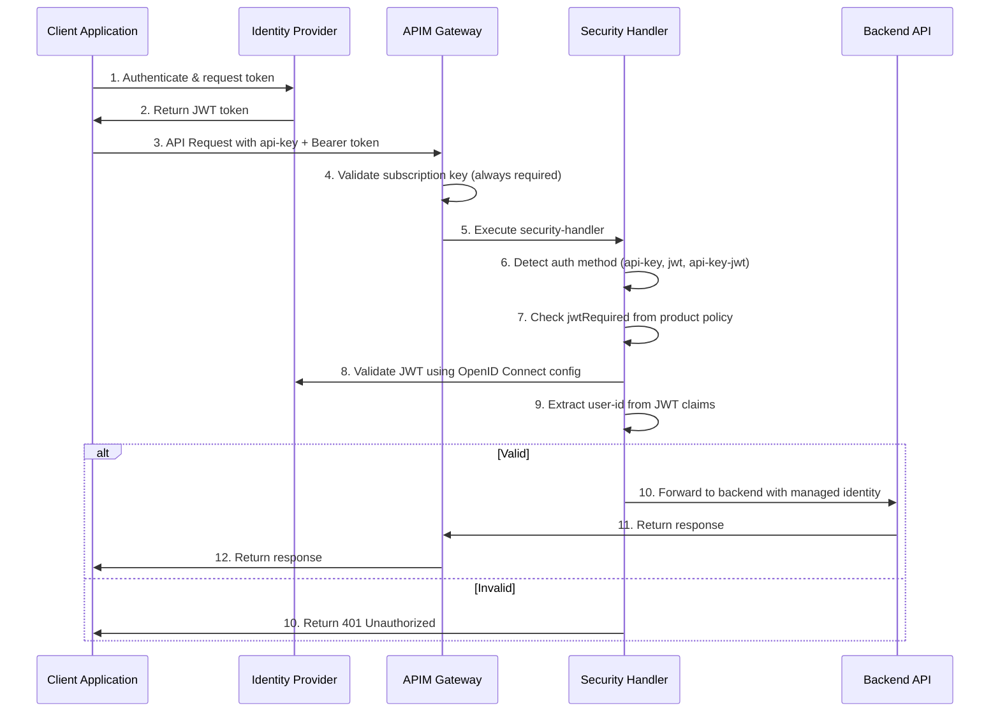
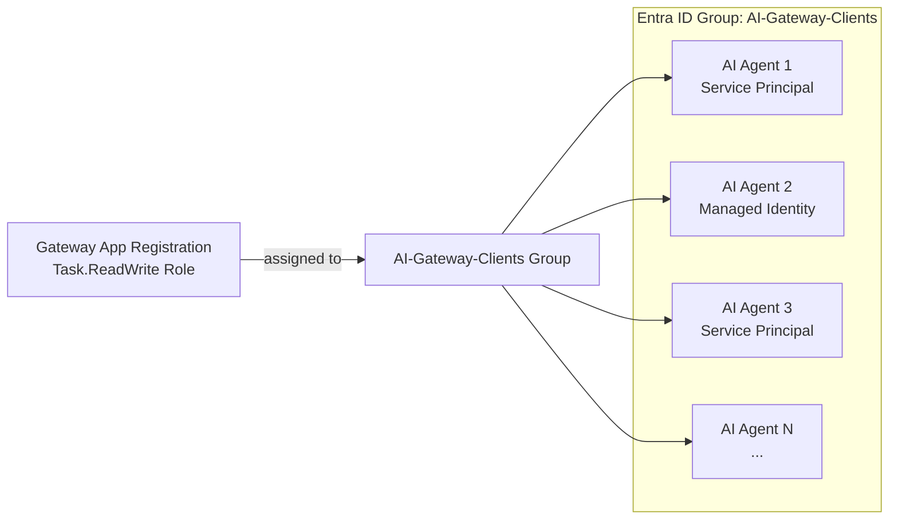

# Understanding JWT Token Authentication with AI Hub Gateway

For use cases requiring additional security beyond subscription keys, JWT token validation provides a robust second authentication layer. The AI Hub Gateway uses a **unified `security-handler` policy fragment** that enforces consistent JWT authentication across all three API endpoints: Azure OpenAI API, Universal LLM API, and Unified AI API out of the box (can be extended to additional endpoints like other APIs and MCPs as well).

The gateway supports any **OAuth 2.0 / OpenID Connect** identity provider (Microsoft Entra ID, Auth0, Okta, etc.) via configurable APIM named values.

## Unified Authentication Architecture

JWT authentication is controlled per-product via Access Contracts:
- **API Key Only (default)**: Access contracts that only require a valid APIM subscription key
- **API Key + JWT (enforced)**: Access contracts that set `jwtRequired=true` to require both API key and valid JWT Bearer token

The `security-handler` fragment is included in **all three API-level policies**, providing uniform authentication behavior regardless of which endpoint a client uses.



## Approach 1: Access Contract JWT Integration (Recommended)

This is the recommended approach for the AI Hub Gateway. It uses Access Contracts to enforce JWT authentication per-product and works uniformly across all three API endpoints.

### Setup

**Step 1: Configure JWT Named Values**

For Microsoft Entra ID, run the setup script (detailed guide is here[entra-id-setup/README.md](../bicep/infra/entra-id-setup/)) to create an app registration and populate the following APIM named values:

```bash
cd bicep/infra/entra-id-setup
pwsh ./setup.ps1
```

For other identity providers, or for manually configured Entra ID tenants, these APIM named values must be set in the Azure portal or via CLI:

| Named Value | Description | Example (Entra ID) | Example (Auth0) |
|-------------|-------------|---------------------|-----------------|
| `JWT-OpenIdConfigUrl` | OpenID Connect discovery endpoint | `https://login.microsoftonline.com/{tenant}/v2.0/.well-known/openid-configuration` | `https://{domain}/.well-known/openid-configuration` |
| `JWT-Issuer` | Expected token issuer | `https://login.microsoftonline.com/{tenant}/v2.0` | `https://{domain}/` |
| `JWT-AppRegistrationId` | Expected audience claim | `api://{client-id}` | `https://your-api-identifier` |

**Step 2: Create an Access Contract with JWT enabled**

Set `jwtRequired=true` in the product policy:

```xml
<policies>
    <inbound>
        <base />
        <!-- Enable JWT requirement for this product -->
        <set-variable name="jwtRequired" value="true" />
        
        <!-- Other policies (model access, capacity, etc.) -->
    </inbound>
    <backend><base /></backend>
    <outbound><base /></outbound>
    <on-error><base /></on-error>
</policies>
```

**Step 3: Test with JWT token**

```http
POST https://{apim-gateway}/openai/deployments/gpt-4o/chat/completions?api-version=2024-02-15-preview
api-key: {subscription-key}
Authorization: Bearer {jwt-token}
Content-Type: application/json

{
  "messages": [{"role": "user", "content": "Hello"}],
  "max_tokens": 50
}
```

### Validation

Use the [JWT Authentication Validation Notebook](../validation/citadel-jwt-authentication-tests.ipynb) to test end-to-end JWT authentication across all three API endpoints.

## Configuring Client Application Identities

Client applications (AI agents, backend services, automation pipelines) that connect to JWT-protected gateway endpoints need their own identity to acquire valid tokens. This section explains how to configure different identity types to successfully authenticate with the gateway.

### What the Gateway Validates

The `security-handler` fragment validates the following JWT claims:

| Claim | Validated Against | Description |
|-------|-------------------|-------------|
| **Audience (`aud`)** | `JWT-AppRegistrationId` named value | The token must be issued for the gateway's audience (e.g., `api://{gateway-app-id}`) |
| **Issuer (`iss`)** | `JWT-Issuer` named value | The token must come from the expected identity provider |
| **Signature** | Keys from `JWT-OpenIdConfigUrl` | The token signature is verified using the provider's public keys |
| **Expiry (`exp`)** | Current time | The token must not be expired |

The gateway does **not** restrict which specific client applications can connect — any identity in your tenant that can obtain a token with the correct audience and issuer will be accepted. Access control is enforced via the APIM subscription key (API key), which ties the request to a specific Access Contract (aka APIM Product).

### Granting Gateway Access via Entra ID Groups (Recommended)

Instead of granting the gateway's app role to each client identity individually, use an **Entra ID security group** to manage access at scale. Assign the gateway's app role to the group once, then add or remove client identities (service principals, managed identities) as group members.



#### Step 1: Create a Security Group

Create an Entra ID security group that will hold all client identities authorized to access the gateway:

```bash
# Create a security group for gateway clients
az ad group create --display-name "AI-Gateway-Clients" --mail-nickname "ai-gateway-clients" --description "Service principals and managed identities authorized to access the AI Hub Gateway JWT-protected APIs"
```

Note the group's `id` (object ID) from the output.

#### Step 2: Assign the Gateway's App Role to the Group

Assign the gateway's `Task.ReadWrite` app role to the group. This is a one-time operation:

```bash
# Get the gateway app's service principal ID
$gatewaySpId = az ad sp list --filter "appId eq '{gateway-app-id}'" --query "[0].id" --output tsv

# Get the Task.ReadWrite app role ID from the gateway's app registration
$roleId = az ad app show --id {gateway-app-object-id} --query "appRoles[?value=='Task.ReadWrite'].id" --output tsv

# Get the group's object ID
$groupId = az ad group show --group "AI-Gateway-Clients" --query "id" --output tsv

# Assign the app role to the group
az rest --method POST `
  --uri "https://graph.microsoft.com/v1.0/groups/$groupId/appRoleAssignments" `
  --headers "Content-Type=application/json" `
  --body "{\"principalId\":\"$groupId\",\"resourceId\":\"$gatewaySpId\",\"appRoleId\":\"$roleId\"}"
```

> **Prerequisite:** The group must be a **security group** (not Microsoft 365 group). The assigning user needs at least the **Cloud Application Administrator** or **Privileged Role Administrator** Entra ID role.

#### Step 3: Add Client Identities to the Group

Onboarding a new client is now a single group membership operation:

**Add a service principal:**
```bash
# Get the client app's service principal object ID
$clientSpId = az ad sp list --filter "appId eq '{client-app-id}'" --query "[0].id" --output tsv

# Add to the group
az ad group member add --group "AI-Gateway-Clients" --member-id $clientSpId
```

**Add a managed identity:**
```bash
# Get the managed identity's principal ID
$miPrincipalId = az identity show --name my-ai-agent-identity --resource-group my-rg --query "principalId" --output tsv

# Add to the group
az ad group member add --group "AI-Gateway-Clients" --member-id $miPrincipalId
```

**Verify membership:**
```bash
az ad group member list --group "AI-Gateway-Clients" --query "[].{name:displayName, type:@odata.type, id:id}" --output table
```

**Remove a client (offboarding):**
```bash
az ad group member remove --group "AI-Gateway-Clients" --member-id {principal-id}
```

#### Why Groups Are Preferred

| Aspect | Per-Identity Role Assignment | Group-Based Assignment |
|--------|------------------------------|------------------------|
| **Onboarding** | Graph API call per identity | `az ad group member add` |
| **Offboarding** | Find and remove role assignment | `az ad group member remove` |
| **Audit** | Query each identity's role assignments | `az ad group member list` |
| **Scale** | O(n) API calls for n agents | O(1) role assignment + O(n) group adds |
| **Governance** | Scattered across identity objects | Single group with clear membership |

> **Note:** Group membership changes propagate within minutes. New members can acquire tokens with the correct audience immediately after being added.

### Identity Type 1: Entra ID App Registration (Service Principal)

Use this when the client application runs outside Azure (on-premises, other clouds, developer workstations) or when you need explicit credentials (client ID + secret/certificate).

#### Step 1: Create or Use an Existing App Registration

The client application needs its own app registration in the **same Entra ID tenant** as the gateway:

```bash
# Create a new app registration for the client
az ad app create --display-name "my-ai-agent"
```

Note the `appId` from the output — this is the client's identity.

#### Step 2: Create a Client Secret

>NOTE: For production scenarios, consider using a certificate credential instead of a client secret for improved security.

```bash
# Get the app's object ID
az ad app list --display-name "my-ai-agent" --query "[0].id" --output tsv

# Generate a credential
az ad app credential reset --id {app-object-id} --display-name "gateway-access" --years 1
```

Store the generated `password` securely (e.g., Azure Key Vault, environment variable).

#### Step 3: Grant Permission to the Gateway's App Registration

The client app needs permission to request tokens scoped to the gateway's audience.

**Recommended: Add to the `AI-Gateway-Clients` group** (see [Group-Based Access](#granting-gateway-access-via-entra-id-groups-recommended) above):

```bash
# Ensure the client app has a service principal
az ad sp create --id {client-app-id} 2>$null

# Get the service principal's object ID
$clientSpId = az ad sp list --filter "appId eq '{client-app-id}'" --query "[0].id" --output tsv

# Add to the gateway clients group
az ad group member add --group "AI-Gateway-Clients" --member-id $clientSpId
```

**Alternative: Direct app role assignment** (for single-identity scenarios):

<details>
<summary>Click to expand direct assignment instructions</summary>

**Option A: Admin consent via Azure Portal**

1. Navigate to **Entra ID** → **App registrations** → Select the **client** app (e.g., "my-ai-agent")
2. Go to **API permissions** → **Add a permission**
3. Select **APIs my organization uses** → Search for the gateway app name (e.g., `ai-hub-gateway-{env}-unified-ai`)
4. Select the **`access_as_user`** delegated permission (or the `Task.ReadWrite` application role)
5. Click **Grant admin consent** for the tenant

**Option B: CLI**

```bash
# Get the gateway app's service principal ID
$gatewaySpId = az ad sp list --filter "appId eq '{gateway-client-id}'" --query "[0].id" --output tsv

# Get the gateway app's appRole ID (Task.ReadWrite)
$roleId = az ad app show --id {gateway-app-object-id} --query "appRoles[?value=='Task.ReadWrite'].id" --output tsv

# Assign the app role to the client's service principal
az rest --method POST --uri "https://graph.microsoft.com/v1.0/servicePrincipals/{client-sp-id}/appRoleAssignments" --headers "Content-Type=application/json" --body "{\"principalId\":\"{client-sp-id}\",\"resourceId\":\"$gatewaySpId\",\"appRoleId\":\"$roleId\"}"
```

</details>

> **Note:** Admin consent or app role assignment is required for the client credentials flow. Without it, the token request will fail with `AADSTS65001: The user or administrator has not consented to use the application`.

#### Step 4: Acquire a Token

```python
import requests

token_response = requests.post(
    f"https://login.microsoftonline.com/{tenant_id}/oauth2/v2.0/token",
    data={
        "grant_type": "client_credentials",
        "client_id": "{client-app-id}",
        "client_secret": "{client-secret}",
        "scope": "api://{gateway-app-id}/.default"
    }
)

jwt_token = token_response.json()["access_token"]
```

#### Step 5: Call the Gateway

```python
response = requests.post(
    f"https://{apim-gateway}/openai/deployments/gpt-4o/chat/completions?api-version=2024-12-01-preview",
    headers={
        "api-key": "{subscription-key}",
        "Authorization": f"Bearer {jwt_token}",
        "Content-Type": "application/json"
    },
    json={
        "messages": [{"role": "user", "content": "Hello"}],
        "max_tokens": 50
    }
)
```

### Identity Type 2: Azure Managed Identity

Use this when the client application runs on an Azure compute service (Azure Functions, Container Apps, App Service, Azure VM, AKS). Managed identities eliminate the need to manage credentials — Azure handles certificate rotation automatically.

#### Step 1: Enable Managed Identity on the Compute Resource

**System-assigned identity** (recommended for single-purpose services):
```bash
# Example: Azure Function App
az functionapp identity assign --name my-ai-agent-func --resource-group my-rg
```

**User-assigned identity** (recommended for shared identity across services):
```bash
# Create the identity
az identity create --name my-ai-agent-identity --resource-group my-rg

# Assign to compute
az functionapp identity assign --name my-ai-agent-func --resource-group my-rg --identities /subscriptions/{sub}/resourceGroups/my-rg/providers/Microsoft.ManagedIdentity/userAssignedIdentities/my-ai-agent-identity
```

Note the `principalId` (object ID) and `clientId` from the output.

#### Step 2: Grant Permission to the Gateway's App Registration

**Recommended: Add to the `AI-Gateway-Clients` group** (see [Group-Based Access](#granting-gateway-access-via-entra-id-groups-recommended) above):

```bash
# Get the managed identity's principal ID
$miPrincipalId = az identity show --name my-ai-agent-identity --resource-group my-rg --query "principalId" --output tsv

# Add to the gateway clients group
az ad group member add --group "AI-Gateway-Clients" --member-id $miPrincipalId
```

**Alternative: Direct app role assignment:**

<details>
<summary>Click to expand direct assignment instructions</summary>

```bash
# Get the gateway app's service principal
$gatewaySpId = az ad sp list --filter "appId eq '{gateway-client-id}'" --query "[0].id" --output tsv

# Get the Task.ReadWrite role ID
$roleId = az ad app show --id {gateway-app-object-id} --query "appRoles[?value=='Task.ReadWrite'].id" --output tsv

# Assign the app role to the managed identity
az rest --method POST --uri "https://graph.microsoft.com/v1.0/servicePrincipals/{managed-identity-principal-id}/appRoleAssignments" --headers "Content-Type=application/json" --body "{\"principalId\":\"{managed-identity-principal-id}\",\"resourceId\":\"$gatewaySpId\",\"appRoleId\":\"$roleId\"}"
```

</details>

> **Important:** Without either group membership or direct role assignment, the managed identity can obtain a token from Entra ID, but the `aud` claim won't match the gateway's expected audience, causing a 401.

#### Step 3: Acquire a Token Using Azure Identity SDK

```python
from azure.identity import DefaultAzureCredential

credential = DefaultAzureCredential()

# The scope must be the gateway's Application ID URI with /.default
token = credential.get_token("api://{gateway-app-id}/.default")
jwt_token = token.token
```

For user-assigned managed identity, specify the client ID:

```python
from azure.identity import ManagedIdentityCredential

credential = ManagedIdentityCredential(client_id="{managed-identity-client-id}")
token = credential.get_token("api://{gateway-app-id}/.default")
jwt_token = token.token
```

#### Step 4: Call the Gateway

```python
response = requests.post(
    f"https://{apim-gateway}/models/chat/completions?api-version=2024-05-01-preview",
    headers={
        "api-key": "{subscription-key}",
        "Authorization": f"Bearer {jwt_token}",
        "Content-Type": "application/json"
    },
    json={
        "model": "gpt-4o",
        "messages": [{"role": "user", "content": "Hello"}],
        "max_tokens": 50
    }
)
```

### Identity Type 3: External Identity Provider (Non-Entra)

For client applications authenticating via a non-Entra identity provider (Auth0, Okta, AWS Cognito), configure the gateway's APIM named values to point to the external provider's OpenID Connect endpoints. The client then acquires a token from that provider using its native SDK.

The key requirement is that the token's `aud` (audience) and `iss` (issuer) claims match the values configured in the gateway's APIM named values.

### Summary: Client Identity Configuration Checklist

| Step | Service Principal | Managed Identity |
|------|-------------------|------------------|
| 1. Create identity | `az ad app create` + `az ad sp create` | `az identity create` or enable on compute |
| 2. Create credential | `az ad app credential reset` | Not needed (Azure-managed) |
| 3. Grant gateway access | `az ad group member add` (recommended) | `az ad group member add` (recommended) |
| 4. Acquire token | `POST /oauth2/v2.0/token` with client credentials | `DefaultAzureCredential().get_token()` |
| 5. Call gateway | `api-key` + `Authorization: Bearer {token}` | `api-key` + `Authorization: Bearer {token}` |

### Troubleshooting Client Identity Issues

| Error | Cause | Fix |
|-------|-------|-----|
| `AADSTS65001: not consented` | Client app lacks permission to the gateway API | Grant admin consent or assign app role |
| `AADSTS700016: application not found` | Wrong client ID or wrong tenant | Verify client app exists in the same tenant |
| `AADSTS7000215: invalid client secret` | Secret expired or incorrect | Rotate the secret with `az ad app credential reset` |
| `401: invalid or expired JWT` | Token audience doesn't match gateway config | Verify token `aud` matches `JWT-AppRegistrationId` named value |
| `401: jwt_required` | No Bearer token in request | Add `Authorization: Bearer {token}` header |
| Token works in Postman but not in code | Scope format incorrect | Use `api://{gateway-app-id}/.default` (not just the client ID) |

## Custom JWT Configuration per Access Contract

For scenarios where different products (access contracts) need to validate tokens from **different identity providers** or with **different audiences**, the `security-handler` fragment supports per-product overrides. Set custom variables in the product policy — unset variables fall back to the gateway's APIM named values.

### Override Variables

| Variable | Description | Falls back to Named Value |
|----------|-------------|---------------------------|
| `jwtAudience` | Custom audience claim to validate | `JWT-AppRegistrationId` |
| `jwtIssuer` | Custom token issuer to validate | `JWT-Issuer` |
| `jwtOpenIdConfigUrl` | Custom OpenID Connect discovery URL | `JWT-OpenIdConfigUrl` |

### Example: Product Using a Different Entra ID Tenant

A partner team uses a separate Entra ID tenant. Their access contract overrides the JWT settings:

```xml
<policies>
    <inbound>
        <base />
        <!-- Enable JWT requirement -->
        <set-variable name="jwtRequired" value="true" />
        
        <!-- Override JWT settings for the partner tenant -->
        <set-variable name="jwtAudience" value="api://partner-gateway-app-id" />
        <set-variable name="jwtIssuer" value="https://login.microsoftonline.com/{partner-tenant-id}/v2.0" />
        <set-variable name="jwtOpenIdConfigUrl" value="https://login.microsoftonline.com/{partner-tenant-id}/v2.0/.well-known/openid-configuration" />
        
        <!-- Model access, capacity, etc. -->
        <include-fragment fragment-id="set-llm-requested-model" />
        <set-variable name="allowedModels" value="gpt-4o" />
        <include-fragment fragment-id="validate-model-access" />
    </inbound>
    <backend><base /></backend>
    <outbound><base /></outbound>
    <on-error><base /></on-error>
</policies>
```

### Example: Product Using Auth0

```xml
<policies>
    <inbound>
        <base />
        <set-variable name="jwtRequired" value="true" />
        
        <!-- Override JWT settings for Auth0 -->
        <set-variable name="jwtAudience" value="https://my-api.example.com" />
        <set-variable name="jwtIssuer" value="https://my-company.auth0.com/" />
        <set-variable name="jwtOpenIdConfigUrl" value="https://my-company.auth0.com/.well-known/openid-configuration" />
    </inbound>
    <backend><base /></backend>
    <outbound><base /></outbound>
    <on-error><base /></on-error>
</policies>
```

### Example: Partial Override (Custom Audience Only)

Only the audience differs — issuer and OpenID config use the gateway's defaults:

```xml
<policies>
    <inbound>
        <base />
        <set-variable name="jwtRequired" value="true" />
        
        <!-- Only override audience; issuer and OpenID config fall back to APIM named values -->
        <set-variable name="jwtAudience" value="api://custom-audience-for-this-team" />
    </inbound>
    <backend><base /></backend>
    <outbound><base /></outbound>
    <on-error><base /></on-error>
</policies>
```

### How It Works

```
Product Policy                          Security Handler Fragment
─────────────                          ──────────────────────────
jwtRequired = "true"           ──►     Enforce JWT validation
jwtAudience = "custom-value"   ──►     Use "custom-value" for audience
(jwtIssuer not set)            ──►     Fall back to {{JWT-Issuer}} named value
(jwtOpenIdConfigUrl not set)   ──►     Fall back to {{JWT-OpenIdConfigUrl}} named value
```

This eliminates the need for separate authentication fragments (`aad-auth`, `aad-auth-custom`) — the unified `security-handler` handles all scenarios through a single, composable interface.

## Security Considerations

- **Token Lifetime**: JWT tokens should be short-lived (1 hour or less)
- **Claim Validation**: Consider requiring additional claims for more granular control
- **Secret Management**: Keep client secrets properly secured using Azure Key Vault
- **CORS Policies**: Implement appropriate CORS policies if browser clients will access the API
- **Rate Limiting**: Apply rate limiting policies to prevent abuse
- **Logging**: Enable comprehensive logging for security monitoring
- **Token Refresh**: Implement proper token refresh mechanisms in client applications

## Troubleshooting Common Issues

1. **401 Unauthorized Errors**:
   - Verify audience, issuer, and OpenID config URL values (check both custom overrides and APIM named values)
   - Check token expiration
   - Ensure proper Bearer token format

2. **Token Validation Failures**:
   - Verify OpenID configuration endpoint accessibility
   - Check issuer claim matches expected format
   - Validate audience claim in token matches `jwtAudience` or `JWT-AppRegistrationId`

3. **503 JWT Not Configured**:
   - Neither custom overrides nor APIM named values are set
   - APIM named values contain `"not-configured"` placeholder (run `entra-id-setup/setup.ps1`)

## Best Practices

1. **Use gateway-level named values** for the primary identity provider (configured once via `entra-id-setup/setup.ps1`)
2. **Use per-product overrides** (`jwtAudience`, `jwtIssuer`, `jwtOpenIdConfigUrl`) only when a product requires a different identity provider or audience
3. **Use Entra ID groups** to manage client permissions at scale (see [Group-Based Access](#granting-gateway-access-via-entra-id-groups-recommended))
4. **Monitor authentication metrics** to identify potential security issues
5. **Regularly rotate client secrets** and update configurations accordingly
6. **Test across all three endpoints** using the [JWT Authentication Validation Notebook](../validation/citadel-jwt-authentication-tests.ipynb)

## Related Resources

- [Access Contracts Policy Guide](../bicep/infra/citadel-access-contracts/citadel-access-contracts-policy.md#jwt-authentication-policy) — Configuring JWT per-product
- [JWT Authentication Validation Notebook](../validation/citadel-jwt-authentication-tests.ipynb) — End-to-end testing across all endpoints
- [Entra ID Setup README](../bicep/infra/entra-id-setup/README.md) — Provisioning Entra ID for JWT