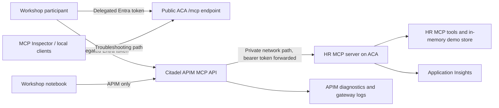

# HR MCP Server Implementation Plan

This plan describes a workshop scenario for building, deploying, governing, and validating an HR-focused Model Context Protocol (MCP) server. It is intended for maintainers who need to resume, adapt, or review the implementation in a public repository.

The scenario deploys a Python MCP server to Azure Container Apps (ACA), secures direct and gateway-mediated tool access with Microsoft Entra delegated authentication, publishes the server through Azure API Management (APIM) with a Citadel-style access contract, and demonstrates consumption from workshop tooling and a notebook.

---

## Goals

- Provide a self-contained HR MCP workshop scenario under `workshop/`.
- Build the MCP container image remotely with Azure Container Registry (ACR); local Docker builds are not required.
- Expose a public ACA troubleshooting endpoint protected by Microsoft Entra OAuth.
- Route the workshop path through APIM using an MCP API, Citadel access contract, rate limiting, and bounded logging.
- Preserve user-level authorization semantics by validating the same delegated token at APIM and the MCP server.
- Emit server telemetry to Application Insights using OpenTelemetry.
- Include enough validation and operational guidance for future maintainers to extend the scenario safely.

## Non-goals

- Replacing the repository's existing Citadel hub deployment.
- Adding runtime dependencies on existing APIM or access-contract samples outside `workshop/`.
- Logging bearer tokens, subscription keys, tenant-specific IDs, subscription IDs, or environment-specific resource names.
- Making the direct ACA endpoint the primary workshop narrative; direct access is for smoke testing and troubleshooting.

---

## Architecture



### Flow summary

1. Deployment scripts create the HR MCP resource group, telemetry, ACR, a public ACA troubleshooting app, a private/internal ACA backend app, and app registration settings.
2. The server exposes `/health` for probes and `/mcp` for streamable HTTP MCP traffic.
3. Participants acquire a delegated Microsoft Entra token for the HR MCP API scope.
4. Direct troubleshooting calls send the bearer token to the public ACA endpoint.
5. Workshop calls go through APIM, where the access-contract policy validates the same delegated token, enforces tool-call limits, and logs bounded request/response details.
6. APIM forwards traffic to the private/internal ACA app over the Citadel hub VNet path and preserves the bearer token for server-side validation.
7. Application Insights and APIM diagnostics provide correlated evidence for tool calls and policy outcomes.

---

## Scope and Design Decisions

- All new implementation files for this scenario must remain under `workshop/` and subfolders.
- The implementation may reference existing repository patterns, but the HR MCP scenario should be deployable from its own workshop assets.
- Scripts should follow the workshop script style: deterministic names, idempotent resource creation, explicit CLI checks, `azd env` integration, and clear terminal output.
- Python dependencies are split by runtime. Notebook/helper dependencies use `workshop/pyproject.toml`; MCP server runtime dependencies use `workshop/mcp-hr/server/pyproject.toml`.
- ACA defaults should minimize cost: ACR Basic, app min replicas `0`, app max replicas `2`, and no unnecessary always-on services.
- APIM-to-ACA traffic must use private connectivity through the existing Citadel hub VNet. The deployment scripts discover the hub VNet in the Citadel hub resource group, inspect its address space and existing subnets, then create/use a dedicated ACA-delegated `snet-mcp` subnet from available space. Overrides are available for VNet/subnet names, prefix length, subnet prefix, or subnet resource ID.
- The public ACA endpoint remains available only for authenticated troubleshooting.
- APIM rate limiting applies only to MCP `tools/call` requests, not protocol setup methods.
- APIM body logging must be bounded and must not log tokens or sensitive headers.
- JSON-RPC batch requests should be rejected or explicitly documented until each embedded `tools/call` can be counted accurately.

---

## Planned Folder Layout

All paths are under `workshop/`.

| Path | Purpose |
| --- | --- |
| `mcp-hr/server/server.py` | FastAPI app, `/health`, MCP JSON-RPC endpoint, and tool registration. |
| `mcp-hr/server/hr_data.py` | Deterministic demo data, read helpers, and mutable in-memory state. |
| `mcp-hr/server/auth.py` | Microsoft Entra token validation helpers. |
| `mcp-hr/server/telemetry.py` | OpenTelemetry and Application Insights setup. |
| `mcp-hr/server/Dockerfile` | Container image definition for ACR remote build. |
| `mcp-hr/hosted-agent/main.py` | Foundry hosted agent (FoundryChatClient + APIM MCP tool + ResponsesHostServer). |
| `mcp-hr/hosted-agent/requirements.txt` | Pinned hosted-agent dependencies (agent-framework split packages, mcp, httpx). |
| `mcp-hr/hosted-agent/Dockerfile` | Hosted-agent image for ACR remote build. |
| `mcp-hr/hosted-agent/agent.yaml` | Reference hosted-agent manifest (env vars documented). |
| `mcp-hr/infra/main.bicep` | Self-contained APIM MCP API, backend, Citadel-style product, subscription, and access-contract template. |
| `mcp-hr/infra/policies/hr-mcp-api-policy.xml` | API-level backend routing policy that binds the MCP API to the HR MCP APIM backend. |
| `mcp-hr/infra/policies/hr-mcp-product-policy.xml` | JWT validation, MCP tool-call rate limiting, and bounded body logging. |
| `mcp-hr/infra/README.md` | APIM publication inputs, private-backend expectations, and policy streaming notes. |
| `mcp-hr/infra/snippets/` | Optional MCP Inspector and GitHub Copilot configuration snippets. |
| `mcp-hr/scripts/deploy-hr-mcp.sh` | Bash deployment for ACA, ACR, telemetry, auth settings, and direct smoke tests. |
| `mcp-hr/scripts/deploy-hr-mcp.ps1` | PowerShell equivalent of direct deployment. |
| `mcp-hr/scripts/publish-hr-mcp-apim.sh` | Bash APIM publication and access-contract deployment. |
| `mcp-hr/scripts/publish-hr-mcp-apim.ps1` | PowerShell equivalent of APIM publication. |
| `mcp-hr/hr-mcp-implementation-plan.md` | Public implementation plan. |
| `9. publish-and-use-hr-mcp-via-apim.ipynb` | Workshop notebook for APIM-mediated MCP validation and agent use. |

The MCP container installs from `mcp-hr/server/requirements.txt`, generated from `mcp-hr/server/pyproject.toml` with uv. Do not add MCP-only runtime packages to the broader workshop notebook environment.

---

## HR MCP Server Design

The server exposes deterministic demo HR data with dynamic results based on request parameters, current dates, and mutable in-memory state.

### Read-only tools

| Tool | Behavior |
| --- | --- |
| `search_employees(query, department=None, location=None)` | Returns ranked employee matches with optional department and location filters. |
| `get_employee_profile(employee_id)` | Returns profile details, manager chain, skills, PTO balance, and policy flags. |
| `recommend_learning_path(employee_id, target_role)` | Computes role-readiness gaps and recommends courses from profile and skill data. |

### Read-write tools

| Tool | Behavior |
| --- | --- |
| `submit_pto_request(employee_id, start_date, end_date, reason)` | Validates business days, PTO balance, blackout dates, and approval routing before creating a request. |
| `update_employee_skills(employee_id, skills, evidence_note)` | Merges skill changes, records an audit event, and returns before/after deltas. |

Write tools should return structured JSON with stable error enums such as `NOT_FOUND`, `INSUFFICIENT_BALANCE`, `POLICY_CONFLICT`, and `STATE_CONFLICT`. Tool-level validation failures should be returned as MCP tool payloads rather than protocol-breaking HTTP errors.

---

## Microsoft Entra Authentication Model

Participants use their own Microsoft Entra identity for every supported client path.

### App registrations

- Create or reuse an Entra API app registration for the HR MCP resource.
- Use an Application ID URI pattern such as `api://<hr-mcp-api-client-id>`.
- Expose a delegated scope such as `Mcp.Access` or `user_impersonation`.
- Create or reuse a public client app registration for local tools and notebooks.
- Save only non-secret configuration values to `azd env`, including tenant, audience, scope, and public client identifiers.

### Direct ACA access

- Participants acquire a delegated token for the HR MCP scope.
- Calls to the public ACA `/mcp` endpoint include `Authorization: Bearer <token>`.
- The MCP server validates issuer, audience, signature, expiry, and required delegated scope.
- `/health` may remain unauthenticated for ACA probes, but it must not expose sensitive data.

### APIM access

- Participants call the APIM MCP endpoint with the same delegated token.
- APIM validates issuer, audience, expiry, and required delegated scope in the access-contract policy.
- APIM forwards the original bearer token to the private ACA backend.
- The MCP server performs the same validation for direct and APIM-mediated calls.

### Local clients and notebooks

- Scripts should print token acquisition commands that use placeholders, for example `az account get-access-token --scope api://<hr-mcp-api-client-id>/Mcp.Access`.
- MCP Inspector and GitHub Copilot snippets should include the MCP endpoint and an `Authorization` header placeholder.
- The notebook should acquire delegated tokens with `InteractiveBrowserCredential`, `DeviceCodeCredential`, or `AzureCliCredential`.
- Raw tokens must never be printed or logged.

---

## Direct ACA Deployment Plan

The direct deployment scripts should:

1. Read defaults from `azd env`, including location, subscription context, and base resource group.
2. Create a separate HR MCP resource group.
3. Create Log Analytics and workspace-based Application Insights.
4. Create or configure Entra app registrations for delegated participant access.
5. Create an ACR Basic registry with admin access disabled.
6. Build the MCP server image remotely with ACR.
7. Create a public ACA environment and Container App on port `8080`.
8. Configure public external ingress for direct troubleshooting.
9. Discover the Citadel hub VNet in the hub resource group and create/use the dedicated ACA-delegated `snet-mcp` subnet by selecting an available prefix from the existing VNet address space.
10. Create a private/internal ACA environment and Container App in that subnet for APIM backend traffic.
11. Configure scaling with min replicas `0` and max replicas `2` for both apps.
12. Set environment variables for authentication, telemetry, and service identity.
13. Add health and startup probes.
14. Save public direct endpoint, private backend endpoint, Citadel VNet/subnet, and non-secret auth values to `azd env`.
15. Run direct smoke tests for `/health`, `initialize`, `tools/list`, one read tool, and one write tool.

Before the image build, MCP server dependency changes must use the server-local `uv` workflow:

```bash
cd workshop/mcp-hr/server
uv pip compile pyproject.toml -o requirements.txt
```

---

## APIM Publishing and Citadel Access Contract

APIM assets should be self-contained under `workshop/mcp-hr/infra/`.

### MCP API publication

- Publish the HR MCP server as an APIM API with `type: mcp`.
- Use a stable path such as `hr-mcp`.
- Configure an APIM backend that reaches the private/internal ACA app over private networking. The publication scripts should prefer `HR_MCP_PRIVATE_BACKEND_URL`, emitted by `deploy-hr-mcp.*`.
- The APIM endpoint is `${gatewayUrl}/hr-mcp/mcp`; the backend value is the ACA base URL without a trailing `/mcp`.
- If private ACA reachability is not yet configured, the publication scripts require `HR_MCP_PRIVATE_BACKEND_URL` or `HR_MCP_APIM_BACKEND_BASE_URL` when `HR_MCP_APIM_REQUIRE_PRIVATE_BACKEND=true` instead of silently publishing a public-only backend. The direct public ACA endpoint remains available for authenticated troubleshooting.
- Preserve MCP streamable HTTP behavior and avoid unsafe response buffering.
- Add correlation headers where they do not interfere with MCP transport.

### Access contract

- Create a Citadel-style APIM product such as `MCP-HR-Tools-DEV`.
- Attach the `hr-mcp` API to the product.
- Create a subscription such as `MCP-HR-Tools-DEV-SUB-01` for consistency with existing access-contract conventions.
- Keep participant Entra tokens as the primary identity mechanism.
- Store or output only non-secret metadata consistently with workshop patterns.

### Product policy

The product policy should:

- Validate Entra JWTs for the HR MCP API audience and delegated scope.
- Allow normal MCP protocol setup methods without tool-call rate-limit impact:
  - `initialize`
  - `notifications/initialized`
  - `tools/list`
  - `prompts/list`
  - `resources/list`
  - `logging/setLevel`
- Apply rate limiting only when the JSON-RPC method is `tools/call`.
- Limit each participant to `5` `tools/call` requests per `30` seconds.
- Use a participant-specific counter key, preferably JWT `oid` plus product or subscription context.
- Return HTTP `429` when the limit is exceeded.
- Reject or document JSON-RPC batch requests if APIM cannot accurately count each embedded `tools/call`.
- Forward the original `Authorization: Bearer ...` header to the HR MCP backend so the server can repeat delegated-token validation.

### APIM logging

APIM should log bounded details for MCP tool calls:

- JSON-RPC method name.
- MCP tool name.
- Participant object ID or another non-sensitive user claim.
- Correlation ID.
- Status code.
- Bounded request body snippet.
- Bounded response body snippet.

Authorization headers, bearer tokens, subscription keys, and other secrets must not be logged. If policy-level response body access interferes with streamable MCP, prefer APIM diagnostic body logging or a documented conditional non-streaming validation path.

The current product policy inspects JSON request bodies to identify `tools/call` and rejects JSON-RPC batch payloads with a JSON `400` error. Response-body snippets are captured only when the response is not `text/event-stream`, preserving streamable MCP behavior where APIM body buffering would be unsafe.

---

## Notebook Plan

Create the notebook after direct deployment and APIM validation are implemented. The notebook should follow existing workshop patterns: infrastructure is deployed by scripts first, then notebook cells discover configuration from `azd env` and validate the scenario.

The notebook should:

1. Load configuration from `azd env`.
2. Verify Azure CLI login and subscription context.
3. Resolve the APIM MCP endpoint and access-contract settings.
4. Acquire a participant delegated Entra token.
5. Create or validate the Citadel-style APIM access contract for the HR MCP API.
6. Validate APIM MCP protocol calls only.
7. Validate APIM HR read and write tool calls only.
8. Trigger the `5` calls per `30` seconds rate limit and show the `429` response.
9. Show where APIM request/response body logs appear.
10. Build or configure a Microsoft Agent Framework app that uses the APIM-published MCP endpoint.
11. Demonstrate an HR workflow through APIM that combines employee lookup, learning-path recommendation, PTO request submission, and skill update.
12. Show relevant Application Insights and APIM telemetry for MCP tool calls.

The notebook should not call the direct ACA endpoint. Direct ACA testing remains a deployment-script and troubleshooting responsibility.

### Microsoft Agent Framework hosted agent

The notebook deploys a Foundry **hosted agent** (same pattern as workshop notebook #7) whose tools come from the HR MCP server **published through APIM**. Source lives in `workshop/mcp-hr/hosted-agent/` (`main.py`, `requirements.txt`, `Dockerfile`, `agent.yaml`):

- `FoundryChatClient` drives reasoning with the same Foundry gateway model as #7 (`Hub-HR-ChatAgent-DEV-LLM/gpt-4.1`).
- `MCPStreamableHTTPTool` (`hr_mcp_via_apim`) targets `HR_MCP_APIM_MCP_URL`. A custom `httpx` client request hook attaches, on every request (handshake + tool calls), a fresh Entra token plus the APIM subscription key — so a long-lived hosted agent never uses an expiring token.
- `ResponsesHostServer` exposes the agent over the Foundry responses protocol.

Authentication is app-to-app via the agent's **managed identity**:

- The HR MCP API app registration exposes a delegated scope `Mcp.Access` (interactive users) **and** an application role `Mcp.Invoke` (applications). Entra forbids a scope and role sharing the same value, hence the two names.
- The agent acquires an app-only token for `api://<hr-mcp-api-client-id>/.default`; the token carries `roles: ["Mcp.Invoke"]`.
- The APIM product policy and the MCP server both accept either the delegated scope (`scp` = `Mcp.Access`) or the app role (`roles` = `Mcp.Invoke`), so users and the hosted agent share one access contract.
- `deploy-hr-mcp.*` creates the app role; the notebook grants it (`appRoleAssignedTo`) and `Foundry User` to the agent's instance managed identity after deployment.

The notebook flow: resolve config → ACR build of `mcp-hr/hosted-agent` → `AIProjectClient.create_version` (injecting `HR_MCP_APIM_MCP_URL`, `HR_MCP_AUDIENCE`, `HR_MCP_APIM_SUBSCRIPTION_KEY`, model) → wait active → grant RBAC/app role → invoke with HR prompts that exercise the MCP tools through APIM.

---

## Validation Plan

Minimum validation during implementation:

- Install Python dependencies in an isolated environment.
- Confirm `workshop/mcp-hr/server/requirements.txt` is current after MCP server dependency changes. Regenerate `workshop/requirements.txt` only when notebook/helper dependencies change.
- Run the MCP server locally and call `/health`.
- Call MCP JSON-RPC methods locally:
  - `initialize`
  - `tools/list`
  - at least one read `tools/call`
  - at least one write `tools/call`
- Run script syntax checks:
  - `bash -n workshop/mcp-hr/scripts/deploy-hr-mcp.sh`
  - PowerShell parse or syntax check if `pwsh` is available.
- Run Azure deployment end to end where permissions and quota allow.
- Confirm ACR remote build succeeds.
- Confirm direct ACA `/health` and `/mcp` calls succeed with a participant token.
- Confirm unauthenticated direct ACA `/mcp` calls fail.
- Confirm APIM `/hr-mcp/mcp` calls succeed with a participant token.
- Confirm APIM-to-ACA backend connectivity uses the private path.
- Confirm APIM returns `429` after more than `5` `tools/call` requests in `30` seconds for the same participant.
- Confirm non-tool MCP protocol methods are not counted against the tool-call limit.
- Confirm APIM logs bounded MCP request and response bodies without logging authorization headers.
- Run the notebook through all non-destructive cells and deterministic write-tool cells.
- Test MCP Inspector or GitHub Copilot configuration from a local machine where feasible.

If Azure permissions, tenant restrictions, or quota block a validation step, document the blocker clearly and keep the implementation runnable for the next validation attempt.

---

## Operational Notes

- Treat generated endpoint URLs, app IDs, scopes, and tenant values as configuration; do not hard-code environment-specific resource names.
- Store secrets only in approved Azure secret stores or APIM subscription records. Do not print raw keys or bearer tokens.
- Keep direct ACA access enabled for troubleshooting but protected by Entra OAuth.
- Use Application Insights correlation IDs and APIM request IDs to connect client calls, gateway policy decisions, and server telemetry.
- Keep APIM logging bounded to reduce cost and avoid leaking HR payloads beyond the workshop intent.
- Review rate-limit values before production reuse; the workshop value is intentionally small to demonstrate throttling.
- Reset mutable in-memory state by restarting the Container App revision; do not rely on in-memory state for production scenarios.
- Disable diagnostic response headers or verbose logging before adapting the pattern to production.

---

## Maintainer Checklist

- [ ] Keep all new scenario files under `workshop/`.
- [ ] Update `workshop/mcp-hr/server/pyproject.toml` before adding MCP server runtime dependencies.
- [ ] Regenerate `workshop/mcp-hr/server/requirements.txt` with `uv`.
- [ ] Validate direct ACA smoke tests before APIM publication.
- [ ] Validate APIM policy behavior before creating the final notebook.
- [ ] Confirm no tenant IDs, subscription IDs, bearer tokens, secrets, or environment-specific resource names are committed.
- [ ] Update this plan if design choices change during implementation.
